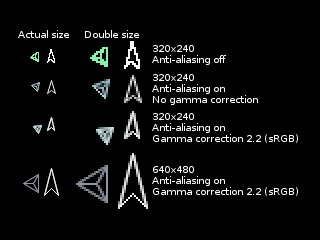

# libcrtxy CRT-XY Library

## News from the original developer

-   September 11, 2009 - Last code changes were from December, then life
    got in the way! I just rolled together a 0.0.4 source tarball.

## Purpose

The purpose of "libcrtxy" is to provide an easy way to create
vector-graphics-basic games, similar to arcade games of the late 1970s
and early 1980s, such as **Star Wars**
([KLOV](http://arcade-museum.com/game_detail.php?game_id=9773) \|
[Wikipedia](http://en.wikipedia.org/wiki/Star_Wars_(1983_video_game))),
**Battlezone** ([KLOV](http://arcade-museum.com/game_detail.php?game_id=7059)
\|
[Wikipedia](http://en.wikipedia.org/wiki/Battlezone_(1980_video_game))),
**Lunar Lander** ([KLOV](http://arcade-museum.com/game_detail.php?game_id=8465)
\|
[Wikipedia](http://en.wikipedia.org/wiki/Lunar_Lander_(1979_video_game))),
**Asteroids** ([KLOV](http://arcade-museum.com/game_detail.php?game_id=6939) \|
[Wikipedia](http://en.wikipedia.org/wiki/Asteroids_(video_game))),
**Tempest** ([KLOV](http://www.arcade-museum.com/game_detail.php?game_id=10065)
\| [Wikipedia](http://en.wikipedia.org/wiki/Tempest_(video_game))),
and, of course, **Space Wars**
([KLOV](http://arcade-museum.com/game_detail.php?game_id=9691) \|
[Wikipedia](http://en.wikipedia.org/wiki/Space_Wars)).

## What's the Point?

Some of Bill Kendrick's first games for modern systems (X-Window on Solaris in the
late 1990s) were 3D games drawn using vector outlines (e.g.,
[ICBM3D](http://www.newbreedsoftware.com/icbm3d/)). One of his games,
[Vectoroids](http://www.newbreedsoftware.com/vectoroids/), has been
ported to many platforms, including mobile devices and handheld game
systems. This is no doubt because it's scalable (thanks to vector
graphics), doesn't require much horsepower (it uses fixed-point math
and trigonometric look-up tables), and is written atop a highly
portable library (libSDL).

I have a number of years experience doing cellphone game development
on BREW and J2ME. The games that were easiest to port were some
classic-arcade-style vector games, for the same reasons Vectoroids has
been ported so often.

While doing mobile game development, one learns that there are many
screen sizes to deal with, many CPU speeds to deal with, and therefore
it's easiest to think of your game in a virtual canvas, and map those
positions onto the physical screen. To keep gameplay timing and
movement close, regardless of the different sizes and speeds of phone
it will run on, frame-rate independent code works best.

libcrtxy puts these concepts together into a light API on top of
libSDL.

## Goal

The goals for libcrtxy are:

-   Don't care about CPU or FPU — be fast, encourage framerate
    independence, and encourage use of fixed-point math.
-   Scale — screen size shouldn't matter to a vector-based game, since
    vectors scale. A game should play, more-or-less, the same on a 2GHz
    PC with an Nvidia graphics card as it does on a 200MHz ARM-based
    handheld with a 320x240 screen.
-   Look like an arcade game — on systems with the horsepower, it should
    be possible for a game to look a lot like a real arcade CRT with
    glowing phosphors. (On systems that don't, degrade to pixelated
    lines.)
-   Developers of games don't decide the rendering level — **it's up to
    the user** (or the person packaging the game, say for some
    particular handheld game system or embedded platform) to decide how
    "nice" the game should look.
    -   Environment variables
    -   Config. files
    -   Command-line options
-   Open source license — libcrtxy is released under the [GNU Lesser General Public License (LGPL), version 2.1](http://www.gnu.org/licenses/old-licenses/lgpl-2.1.html). This means you may use it in both open source and commercial games.

## Screenshots

Below are some screenshots of the test programs that come with
libcrtxy's source. When comparing two renders, remember that the game
was not recompiled. libcrtxy itself was given a different set of
options — via the library's configuration file, via command-line
options to the app. which were then passed to the library, and/or via
environment variable.

Drawlines demo at 320x200. Anti-aliasing, alpha-blending and backgrounds are all **off**.

Drawlines demo at 320x200. Anti-aliasing, alpha-blending and backgrounds are all on.

Rockdodge demo at 320x200. Anti-aliasing, alpha-blending are **on**.

## Documentation

You can generate the documentation using Doxygen.

## Help Me!

I'm looking for help implementing all of the neat things I'd like
libcrtxy to do! Know OpenGL and SDL? Can you build library DLLs for
Windows? Etc.!

## Links

-   [Original SourceForge project](http://www.sourceforge.net/projects/libcrtxy/)
-   [Original libcrtxy-devel mailing list](http://sourceforge.net/mailarchive/forum.php?forum_name=libcrtxy-devel)
-   [New Breed Software](http://www.newbreedsoftware.com/) (libcrtxy was
    initiated by Bill Kendrick in July 2008)

## Comments

-   Once again, you have your finger on the pulse of America. The future
    is vector-based games. -John M., 2008-07-31
-   haha, beautiful! Heroically nerdy! -Adam R., 2008-07-31
-   cool -Zach J., 2008-08-01

## Contact

Original author, Bill Kendrick, can be reached by email at:
<bill@newbreedsoftware.com>. You can also find him on IRC
under the nickname **kendrick** or **kendwork**.

